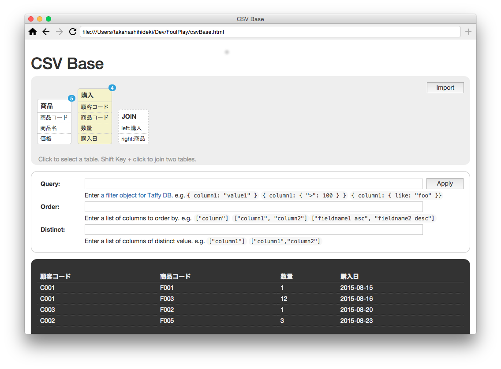

# CSV Base

CSV Base は、ローカルディスクに保存されている CSV ファイルを読み込んで、データベースのようにデータを抽出したり、合成したりするためのアプリです。

## 使い方

### Foul にショートカットを登録

下記の URL を [Foul](https://github.com/takahashihideki-git/Foul) のアドレス欄に入力して表示します。表示されたら、アドレス欄の右にある「+」 ボタンをクリックして、ショートカットに登録します。

http://takahashihideki-git.github.io/FoulPlay/csvBase.html

その後、リロードするか、ホーム画面に追加されたアイコンをクリックして再表示すると、CSV Base に CSVファイルを読み込めるようになります。

### CSVファイルを読み込む

「Import」ボタンをクリックすると、ファイル選択ダイアログが開きます。CSV ファイル（文字コードは UTF8 のみに対応しています）を選択すると、読み込まれた CSV ファイルに対応するテーブルオブジェクトが画面上に作成されます。

テーブルオブジェクトには、ファイル名とカラム名（1行目をカラム名指定行とみなします）の一覧が表示されています。

テーブルオブジェクトをクリックすると、CSVファイルに含まれている全レコードが表示されます。

もう一度クリックすると、レコードは非表示になります。

### CSVファイルを再読み込みする

テーブルオブジェクトにマウスを合わせると、テーブルオブジェクトの左下に、「再読み込み（回転矢印）」アイコンが表示されます。

「リロード」アイコンをクリックすると、テーブルオブジェクトに対応する CSV ファイルの最新の内容を読み込みます。

### テーブルオブジェクトを削除する

テーブルオブジェクトにマウスを合わせると、テーブルオブジェクトの左下に、「削除（×印）」アイコンが表示されます。

「削除」アイコンをクリックすると、テーブルオブジェクトが画面上から削除されます。

### クエリーを指定して、条件に合致するレコードを抽出する

「Query」欄に、抽出条件を表現する Javascript コードを入力して、「Apply」ボタンをクリックすると、指定された条件に合致するレコードが表示されます。

CSV Base は、データベースエンジンに [Taffy DB](http://www.taffydb.com/) を使用しています。抽出条件は、Taffy DB の 「Filter Object」を記述して指定します。

たとえば、カラム "column1" の値が "foo" であるレコードを抽出するには、

    { column1: "foo" }
    
と入力します。

あるいは、カラム "price" の値が 1500 以上であるレコードを抽出するには、

    { price: { ">": 1500 } }

と入力します。

また、カラム "column1" の値が "foo" で、かつ、カラム "column2" の値が "bar" であるレコードを抽出するには、

    { column1: "foo", column2: "bar" }

と入力します。

そのほか、文字列の部分一致、前方一致、後方一致、正規表現マッチ なども指定できます。くわしくは、Taffy DB の[ドキュメント](http://www.taffydb.com/writingqueries)でご確認ください。

### レコードの並び順を指定する

抽出されたレコードの並び順を指定するには、「Order」 欄に、並び順の基準となるカラム名のリストを Javascript の配列として入力して「Apply」ボタンをクリックします。

カラム "column1"　の値を基準に並べるには、

    [ "column1" ]

と入力します。

複数のカラムを指定することもできます。たとえば、まずカラム "column1"　の値を基準に並べ、"column1" の値が同じレコードの一群について、"column2" の値を基準に並べるには、

    [ "column1", "column2" ]
 
 と入力します。
 
 配列の要素には、カラム名に加えて、昇順か降順かを指定するためのキーワードを指定することもできます。昇順のキーワードは "asc"、降順のキーワードは "desc" です。値を数値として評価したい場合は、昇順を "logical"、降順を "logicaldesc" と指定します。
 
    [ "column1 asc", "column2 logicaldesc" ]

### 重複するレコードをまとめて表示する

指定したカラムの値について、重複している複数のレコードを1レコードにまとめて表示するには、Distinct 欄にカラム名のリストを Javascript の配列として入力して「Apply」ボタンをクリックします。

### 二つのテーブルを結合して表示する

あるテーブルオブジェクトをクリックして選択してから、Shiftキーを押しながら別のテーブルオブジェクトをクリックすると、これら2つのテーブルを結合したジョインオブジェクトが画面上に作成されます。

ジョインオブジェクトでは、作成時、先に選択されていたテーブルオブジェクトを「左テーブル」、後から Shiftキーを押しながら選択したテーブルオブジェクトを「右テーブル」とみなします。

ジョインオブジェクトをクリックして選択すると、初期状態では、左テーブルの全レコードを表示します。

「Join」欄に、結合の基準となる左テーブルと右テーブルのカラム名のペアのリストを Javascriptの配列の配列として入力して「Apply」ボタンをクリックすると、指定されたカラムの値が同じ両テーブルのレコードを結合して表示します。
反対側のテーブルに一致するレコードが存在しなかったレコードは表示されません。SQL で Inner Join / 内部結合 と呼ばれる結合方法です。

「select unmached records」項目をチェックすると、左テーブルのレコードのうち、右テーブルに一致するレコードを持たないレコードのみが表示されます。Microsoft Access の「不一致クエリ」で得られる結果と同じです。

### 表示しているレコードを別のCSVファイルとして保存する

レコード一覧の下にある「Save」ボタンをクリックすると、現在表示されているレコードを別のCSVファイルとして保存することができます。保存後、自動的に読み込まれて、対応するテーブルオブジェクトが画面上に作成されます。
