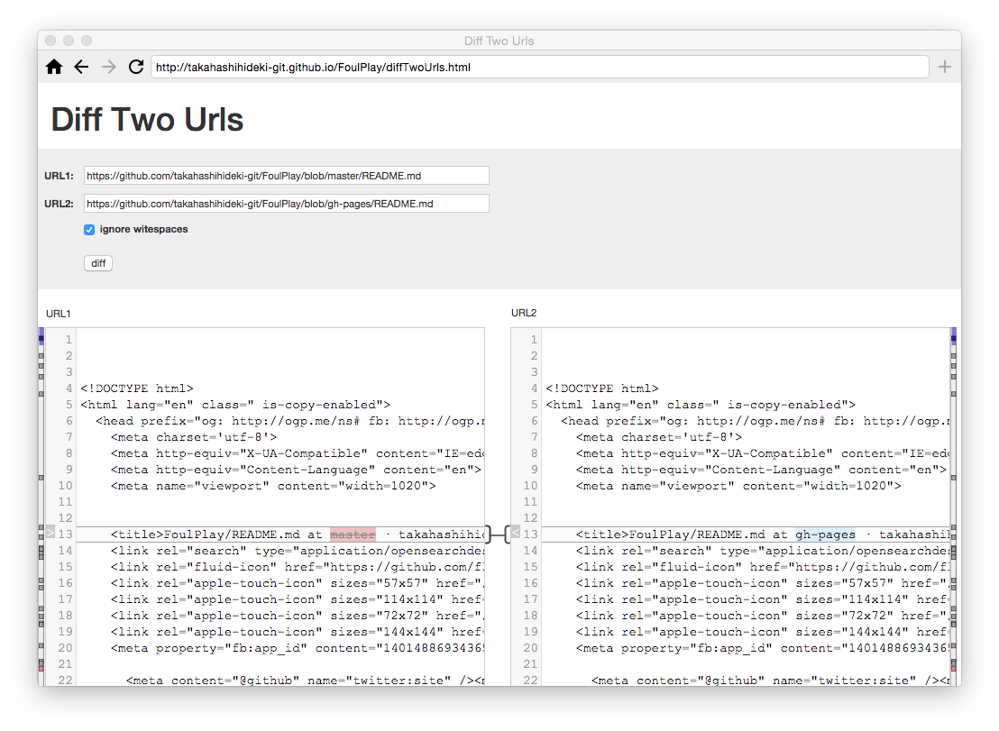

#Diff Two Urls

Diff Two Urls は、2つの URL の HTTP レスポンスボディの内容を比較するためのアプリです。

実体は、[mergely](http://www.mergely.com/) です。制約のない Cross-Origin XMLHttpRequest を実行できる [Foul](https://github.com/takahashihideki-git/Foul) で mergely を動作させることによって、ドメインを超えた「diff」を自由に実行できるようになります。

## 使い方

### Foul にショートカットを登録

下記の URL を [Foul](https://github.com/takahashihideki-git/Foul) のアドレス欄に入力して表示します。表示されたら、アドレス欄の右にある「+」 ボタンをクリックして、ショートカットに登録します。

http://takahashihideki-git.github.io/FoulPlay/diffTwoUrls.html

その後、リロードするか、ホーム画面に追加されたアイコンをクリックして再表示すると、ローカルファイルシステムにアクセスできるようになります。

### URLを入力して「diff」ボタンをクリック

左右のペインにそれぞれの URL の HTTP レスポンスボディが読み込まれ、双方の差分部分がハイライトで表示されます。

