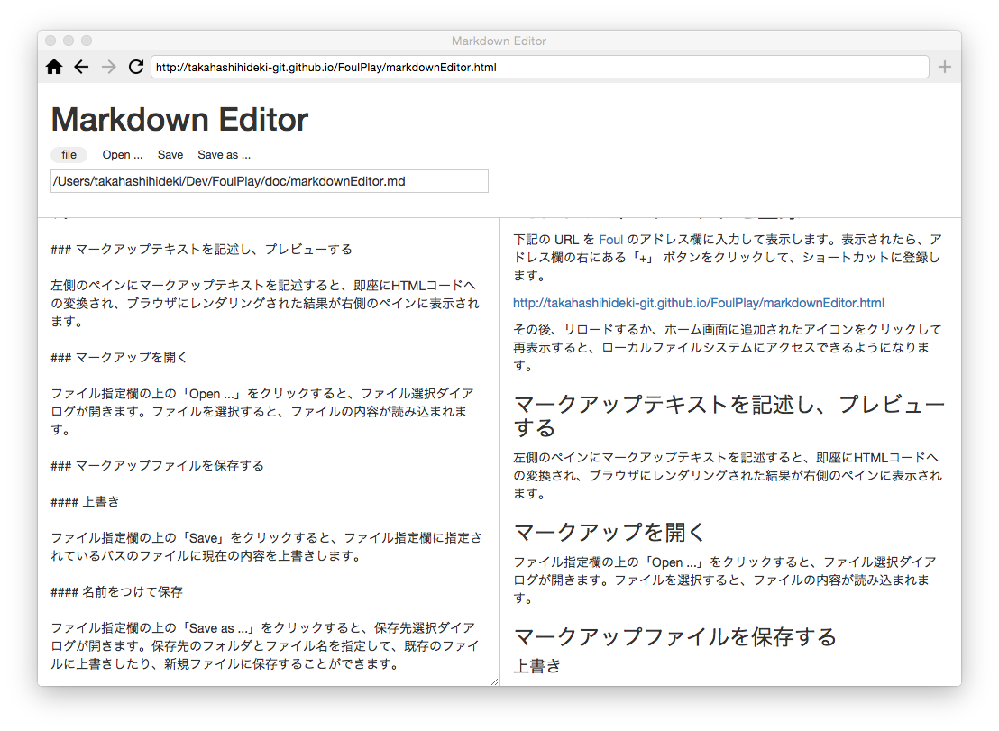

#Markdown Editor

Markdown Editor は、マークダウン形式でマークアップされたテキストを編集し、HTMLコードへの変換結果をプレビューし、ローカルファイルとして保存するためのアプリです。

HTMLコードへの変換には、[marked](https://github.com/chjj/marked) を使用しています。

## 使い方

### Foul にショートカットを登録

下記の URL を [Foul](https://github.com/takahashihideki-git/Foul) のアドレス欄に入力して表示します。表示されたら、アドレス欄の右にある「+」 ボタンをクリックして、ショートカットに登録します。

http://takahashihideki-git.github.io/FoulPlay/markdownEditor.html

その後、リロードするか、ホーム画面に追加されたアイコンをクリックして再表示すると、ローカルファイルシステムにアクセスできるようになります。

### マークアップテキストを記述し、プレビューする

左側のペインにマークアップテキストを記述すると、即座にHTMLコードへの変換され、ブラウザにレンダリングされた結果が右側のペインに表示されます。

### マークアップを開く

ファイル指定欄の上の「Open ...」をクリックすると、ファイル選択ダイアログが開きます。ファイルを選択すると、ファイルの内容が読み込まれます。

### マークアップファイルを保存する

#### 上書き

ファイル指定欄の上の「Save」をクリックすると、ファイル指定欄に指定されているパスのファイルに現在の内容を上書きします。

#### 名前をつけて保存

ファイル指定欄の上の「Save as ...」をクリックすると、保存先選択ダイアログが開きます。保存先のフォルダとファイル名を指定して、既存のファイルに上書きしたり、新規ファイルに保存することができます。

