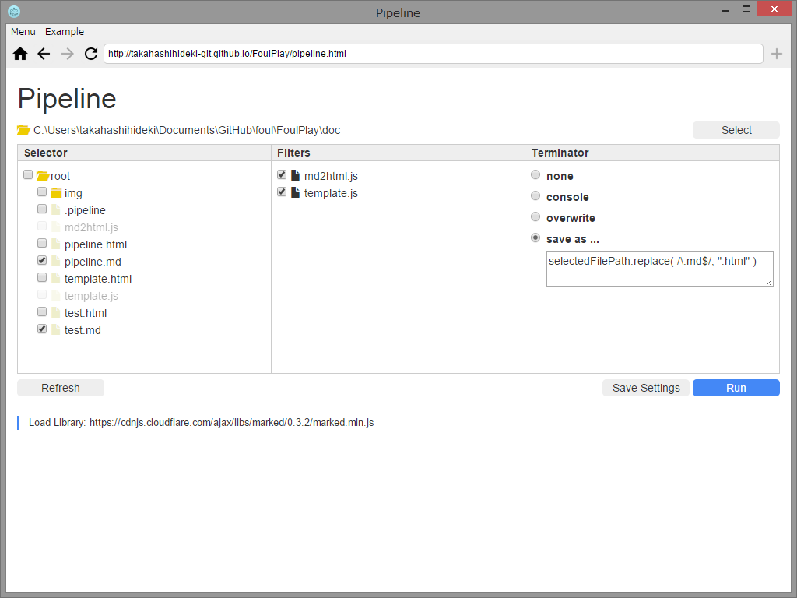

# Pipeline

Pipeline は、複数のテキストファイルの内容を、専用のスクリプトによって一挙に書き換えるような、一括変換作業に奉仕する "GUIコンソール" アプリです。

Pipeline は、ローカルファイルシステムの特定のフォルダを対象にして動作します。一括変換作業の実行者は、Pipeline で任意のフォルダを開き、次の3つの操作パネルの設定を通じて、変換作業のシナリオを決定します。

「Selector」で、一括変換の対象となるテキストファイルを選択します。

「Filters」で、変換を行うスクリプトファイルを指定し、複数のスクリプトファイルを指定した場合は、実行順序を設定します。

「Terminator」 で、変換結果の出力方法を設定します。

Pipeline は、このように、一括変換作業のシナリオを条件や目的に応じて実行者が自由に設定できるようにすることで、テキストの変換を行うスクリプトの責任を軽減します。

Pipeline を前提にしたスクリプトは、作業のコンテクストのことは度外視して、UNIX のコマンドのような"単一責任の原則"の下で、まさに目の前に与えられたテキストの書き換えのみに専念すればよいことになります。
つまり、開発のしやすさ、拡張のしやすさ、保守のしやすさ、再利用のしやすさが高まります。

ひとつひとつはいたって単純なスクリプトの組み合わせを工夫することで、総体としてみれば相当に複雑な一括変換作業をこなすこともできるようになるでしょう。
こうして、Pipeline は結局、この種の一括変換作業環境の構築そのものを、たとえ一度きりで使い捨てても少しも惜しくないほど気軽でカジュアルなものにします。

## 使い方

### Foul にショートカットを登録

下記の URL を Foul のアドレス欄に入力して表示します。表示されたら、アドレス欄の右にある + ボタンをクリックして、ショートカットに登録します。

http://takahashihideki-git.github.io/FoulPlay/pipeline.html

その後、リロードするか、ホーム画面に追加されたアイコンをクリックして再表示すると、ローカルファイルシステムにアクセスできるようになります。

### root フォルダを選択

書き換えの対象となるテキストファイルと、書き換えを行うスクリプトファイルが含まれたフォルダを選択します。

Select ボタンをクリックすると、フォルダ選択ダイアログが開きます。

フォルダを選択すると、下位階層のファイルとフォルダが Selector 欄に読み込まれます。

### 書き換え対象となるテキストファイルを選択

Selector 欄から、書き換え対象となるテキストファイルを選択します。ファイル名の前にあるチェックボックスをチェックします。

フォルダ名の前にあるチェックボックスをチェックすると、そのフォルダ以下に存在するすべてのファイルが選択されます。

### スクリプトファイルを指定

Selector 欄から、スクリプトファイルを選んで、Filters 欄にドラッグアンドドロップで移動します。

複数のスクリプトファイルを Filters 欄に移動して、順番に実行することができます。

Filters 欄でスクリプトファイルをドラッグして、実行の順序を変更することができます。

ファイル名の前にあるチェックボックスのチェックを外したスクリプトファイルは実行されません。

Filters 欄から Selector 欄にファイルをドラッグしてスクリプトファイルの指定を取り消すこともできます。

#### スクリプトファイルの書き方

filter 関数を定義します。

    var filter = function ( content, context, next ) {

        // content の書き換え
        content = content.replace( /foo/g, "bar"  );
        // 書き換えた content を後続の処理に引き渡す
        next( content );

    }

filter 関数には、次の引数が渡されます。

 * 第一引数: Selector 欄で選択されたファイルの内容

 * 第二引数: 次の内容の処理コンテキストオブジェクト

 * 第三引数: 次のフィルターまたはターミネータに処理を引き継ぐためのコールバック関数

第二引数のコンテキストオブジェクトの内容は次のとおりです。

    { 
        path: ファイルのパス
        info: ファイルの情報 → https://github.com/takahashihideki-git/Foul/wiki/window.fileSystem#successfunction-pathstring-filesarray-
        currentFileCount:　全処理対象ファイル中の処理順　1 〜
        globalContext: {
            path: Pipelneが適用されたフォルダのパス
            totalFileCount: 全処理対象ファイル数 
        }
    }
    // globalContext は、全ファイルの処理に共通のオブジェクトです。ここに適当な key value をセットして、後続のファイルの処理に任意の値を引き渡すことができます。

filter 関数は、必ず、第三引数に渡された next 関数に、引数として書き換え後のファイルの内容を与えて実行しなければなりません。

next 関数の引数に false を与えて実行すると、当該のファイルに対する処理は、その時点で中断します。

#### filter 関数で外部のライブラリーを使用したいとき

外部の Javascript ライブラリーを使用するには、次のように dependencies 配列を定義します。

    var dependencies = [
        "https://code.jquery.com/jquery-2.1.4.min.js",
        "https://cdnjs.cloudflare.com/ajax/libs/marked/0.3.2/marked.min.js"
    ];

#### Node.js の標準モジュールも使用できます

次のようにして、filter 関数の内部で、Node.js の標準モジュールを使用することもできます。

    var path = require( 'path' );
    var separator = path.sep;

#### ロギング

次のようにして、filter 関数の内部から各種のログ出力を行うことができます。

    console.log( message )    // Developer Tools のコンソールに出力します。
    Pipeline.log( message )   // Pipeline の画面上に実行ログとして出力します。
    Pipeline.error( message ) // Pipeline の画面上にエラーとして出力します。

### ターミネーターを設定

最後に実行されるスクリプトファイルの出力先を指定します。4つのオプションが用意されています。

 * none
 
   何もせずに終了します。

 * console

   Developer Tools のコンソールに出力します。Developer Tools はメニューから Foul > Developer Tools (Mac) または Menu > Developer Tools (Windows) を選択して開きます。

 * overwrite

   Selector 欄で選択したファイルに上書きします。

 * save as

   指定したパスのファイルに出力します。選択肢の下に用意されたテキストエリアに記述した Javascript コードで出力先のパスを指定します。
   
   変数 selectedFilePath の値は、Selector 欄で選択したファイルのパスです。たとえば、selectedFilePath.replace( /\.csv/, ".json"  ) と記述すると、元のファイルの拡張子を json に置き換えた名前のファイルに出力します。

たとえば、最終的な出力結果をリモートのサーバーに POST するなど、上記のいずれにも当てはまらない処理を最後に行いたいときは、none を選択し、最後に実行されるスクリプトファイル内で、実行するとよいでしょう。

### Run !

Selector 欄でファイルが選択され、Filters 欄にスクリプトファイルが配置されると、「Run」ボタンがアクティブになります。

「Run」ボタンをクリックすると、Selector、Filters、Terminator 欄で決定されたシナリオにしたがって、変換作業が実行されます。

作業中のファイルのオープンや保存に関する作業ログが、Selector 欄の下に表示されます。

変換作業が終了すると、Selector 欄の表示が更新されます。

### リフレッシュ

「Refresh」ボタンをクリックすると、Selector 欄の内容を更新します。

ちなみに、Selector 欄で選択されたファイル、Filters 欄で指定されたスクリプトファイルの内容は、変換作業実行時に読み込まれるので、Pipeline を表示した後で、それらのファイルの内容を書き換えたとしても、Pipeline をロードし直したり、「Refresh」ボタンをクリックする必要はありません。

### 設定の保存

「Save Settings」をクリックすると、Selector 欄、Filters 欄、Terminator 欄の状態を、選択されているフォルダの .pipeline ファイルに保存します。

Pipeline は、フォルダが選択されたとき、.pipeline ファイルが存在していれば、その内容に応じて Selector 欄、Filters 欄、Terminator 欄を初期化します。

フォルダをコピーまたは移動しても、.pipeline ファイルが含まれていれば、コピー先、移動先で保存された状態を再現することができます。
