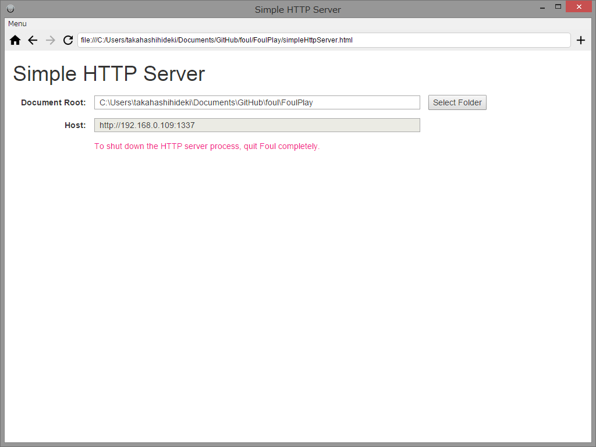

#Simple Http Server

Simple Http Server は、簡易的な Local Network (LAN) HTTP サーバーとして動作するアプリです。

ローカルファイルシステムの任意のフォルダをドキュメントルートに指定することができます。

また、サーバーの起動中、いつでもドキュメントルートを別のフォルダに切り替えることができます。

## 使い方

### Foul にショートカットを登録

下記の URL を [Foul](https://github.com/takahashihideki-git/Foul) のアドレス欄に入力して表示します。表示されたら、アドレス欄の右にある「+」 ボタンをクリックして、ショートカットに登録します。

http://takahashihideki-git.github.io/FoulPlay/simpleHttpServer.html

その後、リロードするか、ホーム画面に追加されたアイコンをクリックして再表示すると、Local Network HTTPサーバーが起動します。

HTTPサーバーが起動すると、「host」欄に、IPアドレスとポート番号からなるホスト名が表示されます。

### ドキュメントルートとしてフォルダを選択

「Select Folder」ボタンをクリックすると、フォルダ選択ダイアログが開きます。

フォルダを選択すると、当該のフォルダ以下に配置されている各種ファイルに、LANに接続している PC やスマートフォンのブラウザからアクセスできるようになります。

たとえば、選択されたフォルダのサブフォルダ doc の sample.html には、次のURLでアクセスすることができます。

	# e.g. 「host」欄に、「http://192.168.0.109:1337」と表示されている場合

	http://192.168.0.109:1337/doc/sample.html

### シャットダウン

サーバーをシャットダウンするには、Foul を終了する必要があります。

### 使用上の注意

Simple HTTP Server を表示したウィンドウで、他のページに遷移すると、HTTPサーバーは応答しなくなります。

また、そのあとで、再び Simple HTTP Server を表示すると、前に起動したHTTPサーバーとの間に、使用するシステムリソースの衝突を起こしてシステムエラーが発生します。

再び Simple HTTP Server を使用する場合は、いったん Foul を終了して、稼働している HTTP サーバーをシャットダウンする必要があります。

接続できない場合は、OS のファイアウォールの設定を見直してみてください。OSには、eletron というアプリケーション名で認識されている可能性があります。
